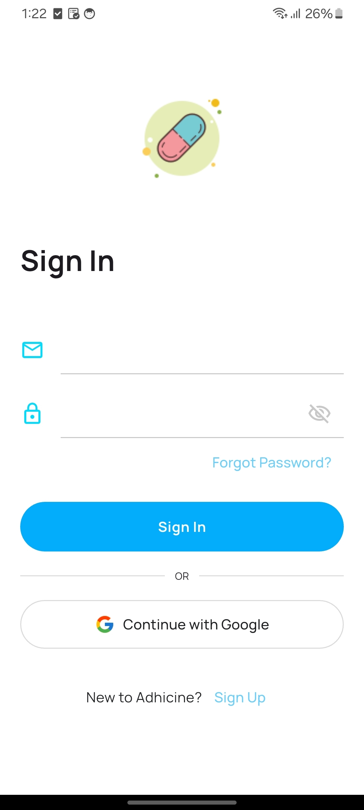
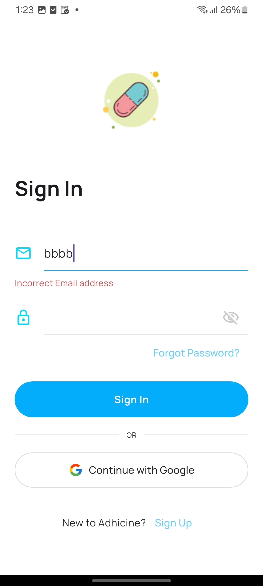
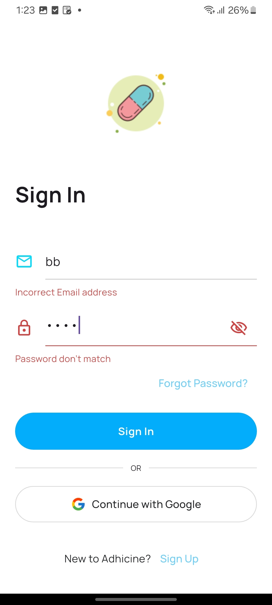
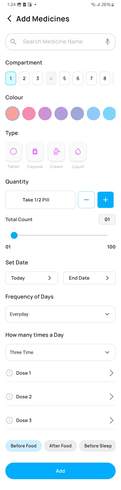
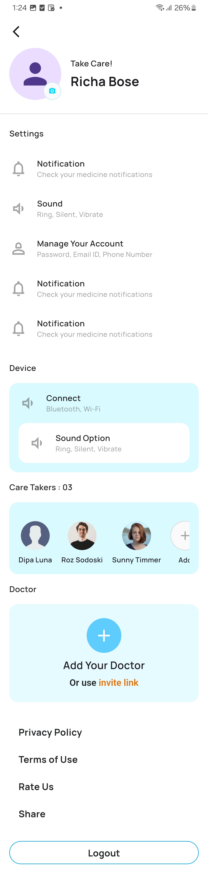
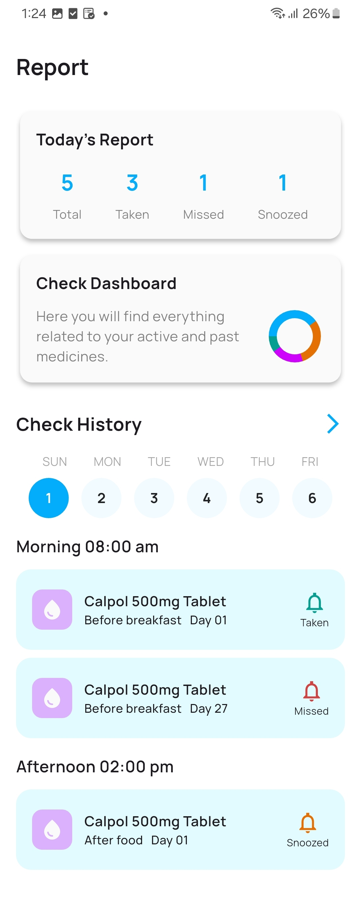
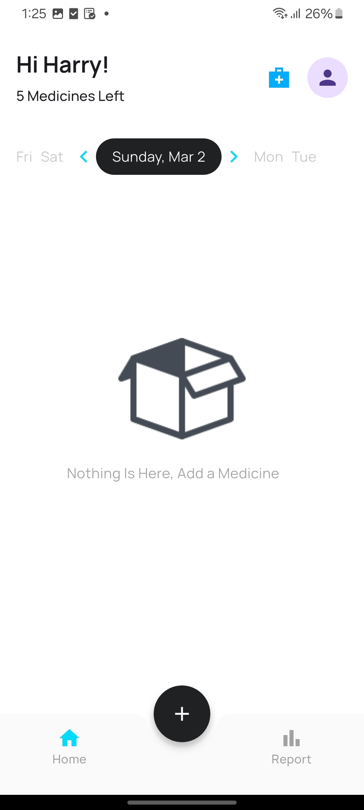
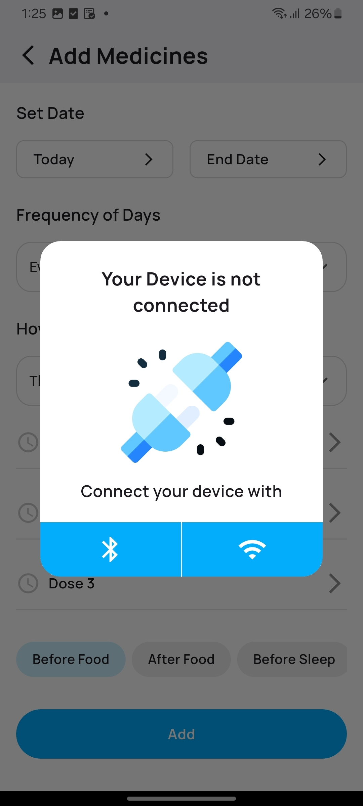

# Flutter Assessment

A new Flutter project.

## 📌 Getting Started

This project is a starting point for a Flutter application.

## 📸 Screenshots

Here are some screenshots of the application:

<p align="center">
  
  
  
</p>

<p align="center">
  
  
  
</p>

<p align="center">
  
  
</p>

---

1️⃣ Clone the repository:
```sh
git clone https://github.com/yourusername/flutter_assessment.git
